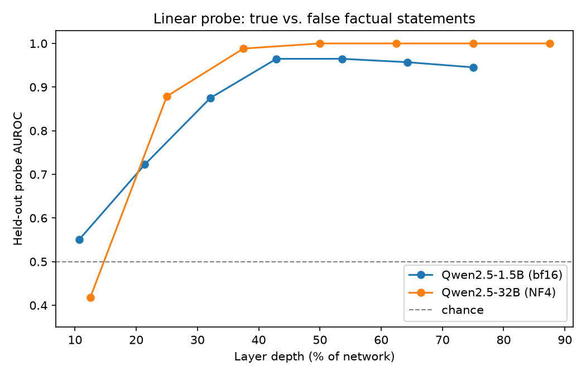
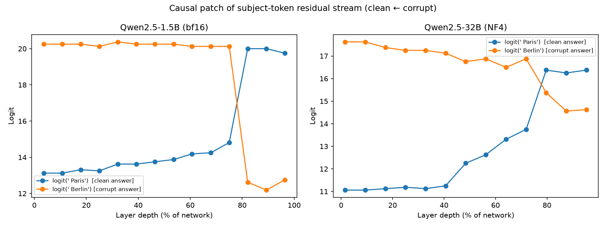
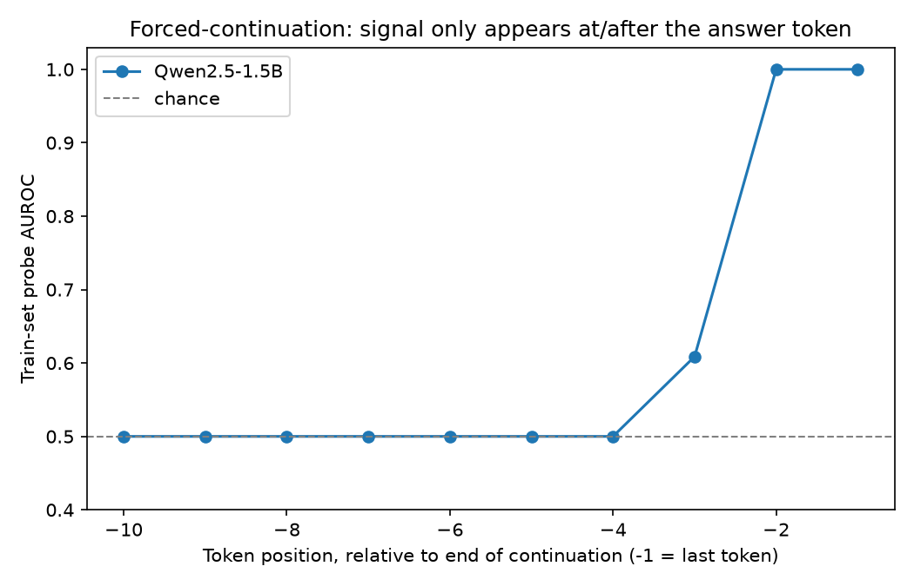
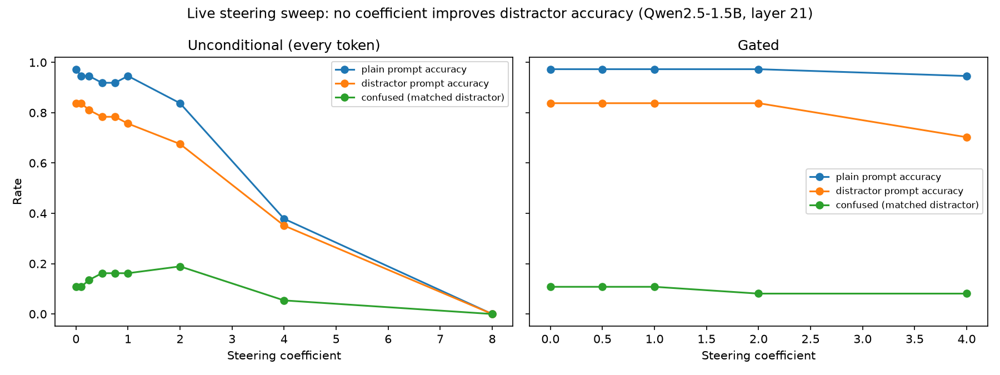

# nn-explore

A minimal, working base for mechanistic-interpretability experiments (linear
probing + causal activation patching) on a single GPU, using
[`nnsight`](https://nnsight.net/) against real Hugging Face checkpoints —
including 4-bit-quantized 32B-parameter models. This repo is meant to be
**cloned/forked as a starting point** on a fresh Vast.ai (or any single-GPU)
instance for follow-on experiments, not as a finished research artifact.

It currently demonstrates the full pipeline end-to-end on a toy task (true vs.
false factual statements) across two model scales:

- `Qwen/Qwen2.5-1.5B-Instruct` (bf16, full precision)
- `unsloth/Qwen2.5-32B-Instruct-bnb-4bit` (pre-quantized NF4, 4-bit)

## Results

### 1. Linear probes: does the model "know" true vs. false?

We extract the residual-stream activation at the **last token** of each
statement, at several layers spread across the network depth, and train a
held-out logistic-regression probe per layer to classify true vs. false.



| Model | Peak AUROC | Layer (depth %) |
|---|---|---|
| Qwen2.5-1.5B (bf16) | 0.96 | ~43-54% |
| Qwen2.5-32B (NF4) | **1.00** | ~50%+ |

Both models linearly encode truth value well before the middle of the
network, and the 32B model reaches **perfect** held-out separability —
consistent with the broader finding (e.g. Azaria & Mitchell 2023, Marks &
Tegmark 2023, Anthropic's deception-probing work) that truth value is one of
the most linearly-decodable properties in a transformer's residual stream,
and that this gets *more* linear with scale, not less.

### 2. Causal patching: is that representation load-bearing, or just a correlate?

A linear probe only shows *correlation*. To test *causation*, we patch the
residual stream at the **subject-token position** (e.g. "France" / "Germany")
from a corrupted prompt into a clean prompt's forward pass, one layer at a
time, and watch whether the output flips:

- Clean:   `"The capital of France is"` → `" Paris"`
- Corrupt: `"The capital of Germany is"` → `" Berlin"`



Both models show the same qualitative signature: patching early/mid layers
does nothing (the fact is "read off" from elsewhere later); there's a **sharp
crossover window** where the patch flips the answer; then the effect fades
in the very last layers because there's no computation left to use it.

| Model | Crossover window (depth %) |
|---|---|
| Qwen2.5-1.5B (bf16) | ~75-82% |
| Qwen2.5-32B (NF4) | ~72-80% |

**Notable finding:** the causal crossover happens *later* in the network than
where the linear probe already saturates (~45-50% depth). In other words, the
fact becomes linearly *readable* well before it becomes *causally load-bearing*
for the actual output token — the representation is present but not yet
"consumed" by the computation that produces the answer. This is a real
mechanistic-interpretability result, not just a pipeline sanity check.

### Why patch the subject token, not the last token?

The original naive approach — patch only the *last* token's residual stream —
does **not** reliably flip the output, even at the "correct" layer. Downstream
attention layers can still see the *unperturbed* subject token elsewhere in
the sequence and reconstruct the original answer from it. Patching the subject
token itself (standard "causal tracing", as in Meng et al.'s ROME paper) is
what actually isolates the causal effect. See `causal_patch.py` for the
token-alignment logic.

### 3. Live steering: can we push generation toward truthfulness in real time?

The natural follow-up question: since a single forward pass already causally
determines its own output (§2), can we intervene *live*, mid-generation, to
correct a model that's about to say something wrong — not just in an offline
oracle-patching demo, but as an actual online steering mechanism? Short
answer: we tried the obvious approach and it doesn't work, for an instructive
reason. Full writeup, including a corrected finding from an earlier
mis-designed experiment, below.

**3a. Forced-continuation per-token probing (and a correction).** `dataset.py`'s
`build_steering_dataset()` extends the true/false template into full
teacher-forced continuations (e.g. `"Question: What is the capital of
France?\nAnswer:"` + `" The capital of France is Paris."` vs. `"...Berlin."`),
and `extract_continuation_probe.py` probes *every token position* of the
continuation, not just the last one. The pooled AUROC comes out much lower
than the static-statement result (~0.72 vs. ~0.96) — but breaking it down by
position relative to the end of the continuation shows why:



Every position before the answer word sits at exactly chance. **This is a
construction artifact, not a finding about the model.** The true and false
continuations share an identical token prefix up to the branch point (`"...is
Paris."` vs `"...is Berlin."` — everything before "Paris"/"Berlin" is the same
tokens either way), so there is *by construction* zero information available
at those positions for a probe to find, regardless of what the model
internally "knows." An earlier pass at this analysis concluded from this that
"the model doesn't know the answer before committing to it" — that conclusion
was wrong; the null result is guaranteed by the matched-prefix design and says
nothing about the model's actual internal state. Real pre-commitment signal
(if it exists) has to come from genuine variation across *different*
questions, not an artificially matched prefix — see Future Work.

**3b. Live steering attempt.** Despite (3a), we already know from §2 that
*something* causal exists to intervene on — so we tried it anyway, live,
using `steer.py`: a forward hook on a mid-to-late layer that adds a generic
"truthfulness" direction (difference-of-means between true/false statement
activations, computed by `extract_and_probe.py --directions_out`) to the
residual stream on every decoding step. To get a genuine error case to correct
(the model gets essentially all of our original 20 well-known capitals right
even under provocation), `dataset.py`'s `build_distractor_dataset()` primes
each question with a confidently-asserted false premise about a *different*
country's capital (e.g. *"Context: I just learned that the capital of France
is Berlin.\nQuestion: What is the capital of France?"*) — a known, reproducible
way to induce entity-confusion errors, over a broadened set of 37 capitals
(20 common + 17 deliberately less-known ones, to get baseline uncertainty
above zero).



| Approach | Result |
|---|---|
| Unconditional (every token) | Monotonic collapse — confusion rate rises slightly (11%→19%) before **total incoherence** by coeff=8 (output degenerates to `"The Capital To Its It The The The..."`). No coefficient ever improves accuracy. |
| Gated (live probe decides per-token) | Gate fires on 43-53% of tokens — far too promiscuous to be "targeted" — and shows no accuracy improvement at any coefficient tested. |

**Diagnosis:** the direction/classifier was trained on exactly one
distribution — the last token of a *complete* statement, where "is this claim
true or false" is a well-posed question. We applied it to a completely
different distribution — the last token of an *in-progress, incomplete*
phrase (including tokens like `"The"`, `"capital"`, `"of"` that have no claim
content yet to judge). Its behavior there is uncalibrated noise, not a
meaningful signal — confirmed by the direction's norm (29.1) already being
~29% of the layer's typical activation norm (~99), meaning even the smallest
tested coefficient was a large, indiscriminate perturbation on every single
token regardless of relevance. More coefficient/threshold tuning won't fix a
train/deploy distribution mismatch.

**What would actually be needed:** train the direction (and any live gate) on
activations from the *actual* target distribution — genuine intermediate
generation states, not post-hoc-labeled complete statements. Concretely: let
the model *actually generate* (sampled, not forced) answers to a broad
mixed-difficulty question set, auto-verify correctness against a known answer
key, and extract activations from those real generation trajectories. This is
a materially bigger lift (needs a much larger, harder, auto-verifiable
question set to get enough natural errors, plus careful separation between
"is a mistake about to happen" detection and the resulting steering vector)
and is the natural next experiment for whoever picks this repo up next — see
Future Work.

## Repo layout

```
dataset.py                     true/false statements, forced-continuation, and distractor datasets
inspect_model.py               quick architecture sanity check for a new model (layer count, module names)
extract_and_probe.py           extract last-token residual activations, train per-layer probes + steering directions
causal_patch.py                subject-token causal patching sweep across layers
extract_continuation_probe.py  per-token probing on forced (teacher-forced) continuations
analyze_position_breakdown.py  per-position AUROC breakdown (why (3a)'s pooled AUROC is misleading)
steer.py                       live activation steering during generation + distractor evaluation harness
plot_results.py                regenerate results/figures/*.png from results/*.csv
results/                       *.csv result tables and the plots above
setup.sh                       one-shot environment bootstrap for a new GPU box
requirements.txt               pinned dependency versions
```

## Setup

```bash
git clone git@github.com:devYaoYH/nn-explore.git
cd nn-explore
./setup.sh
source .venv/bin/activate
```

`setup.sh` detects the GPU's CUDA compute capability and picks a matching
torch build automatically (see **Environment notes** below for why this
matters). If you'd rather do it by hand:

```bash
uv venv --python 3.12 .venv && source .venv/bin/activate
uv pip install torch --index-url https://download.pytorch.org/whl/cu128   # or cu124 on older GPUs
uv pip install -r requirements.txt
```

## Reproducing / extending

```bash
# 1. Sanity-check a model's architecture before writing hooks against it
python inspect_model.py

# 2. Extract activations + train probes (small model, full precision)
python extract_and_probe.py \
    --model Qwen/Qwen2.5-1.5B-Instruct --quant none \
    --out /tmp/activations.npz --results_csv results/probe_auroc.csv

# 3. Same, but for a 4-bit-quantized 32B model
python extract_and_probe.py \
    --model unsloth/Qwen2.5-32B-Instruct-bnb-4bit --quant prequantized \
    --out /tmp/activations.npz --results_csv results/probe_auroc.csv

# 4. Causal patching sweep
python causal_patch.py --model Qwen/Qwen2.5-1.5B-Instruct --quant none \
    --results_csv results/causal_patch.csv
python causal_patch.py --model unsloth/Qwen2.5-32B-Instruct-bnb-4bit --quant prequantized \
    --results_csv results/causal_patch.csv

# 5. Regenerate the figures above
python plot_results.py

# 6. Forced-continuation per-token probing + position breakdown (§3a)
python extract_continuation_probe.py --model Qwen/Qwen2.5-1.5B-Instruct --quant none \
    --out /tmp/cont_activations.npz --results_csv results/continuation_probe.csv
python analyze_position_breakdown.py --activations /tmp/cont_activations.npz --layer 15 \
    --model_label "Qwen2.5-1.5B" --results_csv results/position_breakdown.csv

# 7. Save a generic steering direction, then try live steering (§3b)
python extract_and_probe.py --model Qwen/Qwen2.5-1.5B-Instruct --quant none \
    --out /tmp/activations.npz --directions_out /tmp/directions.npz
python steer.py --model Qwen/Qwen2.5-1.5B-Instruct --quant none \
    --directions /tmp/directions.npz --layer 21 --coeffs 0.0 0.5 1.0 2.0 4.0
# ...or gated (fires only when a live probe flags risk -- still doesn't help, see §3b):
python steer.py --model Qwen/Qwen2.5-1.5B-Instruct --quant none \
    --directions /tmp/directions.npz --layer 21 --coeffs 0.0 0.5 1.0 2.0 4.0 \
    --gate_activations /tmp/activations.npz
```

`--quant` has three modes:
- `none` — load at full precision (bf16). Use for models that fit comfortably.
- `nf4` — quantize on load via `bitsandbytes` `BitsAndBytesConfig`. This
  downloads the **full-precision** checkpoint first, then quantizes locally —
  use only when no pre-quantized checkpoint exists.
- `prequantized` — load a checkpoint that's already stored in 4-bit (e.g. an
  `unsloth/*-bnb-4bit` repo). Much less bandwidth (~19GB vs. ~65GB for a 32B
  model) and just as fast to run — **prefer this when available**.

Swapping to a different model or a different dataset (e.g. an
honest-vs-deceptive-instruction dataset instead of true/false facts) should
only require editing `dataset.py` and re-running steps 2-5 — the extraction,
probing, and patching code is model- and dataset-agnostic as long as the
model exposes `.model.layers[i]` and `.lm_head` (true of most Llama-family /
Qwen-family causal LMs).

## Dataset builders

`dataset.py` generates true/false statements across four factual categories
(country capitals, chemical symbols, small multiplication facts, animal
taxonomic classes), with the false variant swapping in a plausible-but-wrong
value from the same category so the *only* thing that differs is truth value,
not surface form or sentence structure. It's grown four generators as the
experiments progressed:

- `build_dataset()` — 104 static true/false statement pairs (§1, §2 inputs).
- `build_steering_dataset()` — the same facts recast as `(prompt,
  true_continuation, false_continuation)` triples for teacher-forcing (§3a).
- `build_distractor_dataset()` — 37 capital-city questions (20 common +
  `HARD_CAPITALS`, 17 deliberately less-known ones) each paired with a
  false-premise distractor context, for the live steering evaluation (§3b).
- `CAPITALS` / `HARD_CAPITALS` / `ELEMENTS` / `MATH` / `ANIMALS` — the
  underlying fact lists all four generators draw from.

This is a toy stand-in for a real contrastive dataset — swap in something
closer to your actual research question (e.g. the honest-vs-deceptive
instruction-following setup from Anthropic's
["Detecting Strategic Deception Using Linear Probes"](https://alignment.anthropic.com/2024/deception-probes/))
when you're ready to move past pipeline validation.

## Future work

The natural next experiment, informed directly by §3's negative result: train
the steering direction and any live gate on **genuine intermediate generation
states** rather than post-hoc-labeled complete statements. Concretely:

1. Build a broader, genuinely mixed-difficulty factual question set (arithmetic
   difficulty is the safest lever for controllable error rate — no risk of
   the dataset author misremembering a real-world fact; harder chemistry/
   geography facts can supplement it).
2. Let the model actually **generate** (sampled, not forced) answers, and
   auto-verify each against a known answer key.
3. Extract activations from those real generation trajectories — specifically
   at the pre-answer position, across many *different* questions (not a
   matched-prefix pair) — and check whether "will this generation turn out
   correct" is linearly decodable there. This is the correct test of whether
   a genuine pre-commitment ("does the model know this") signal exists; §3a's
   null result does not answer this question, for the reasons discussed above.
4. If it is decodable, retrain the steering direction/gate on that same
   distribution and rerun the `steer.py` distractor evaluation.

Also worth doing regardless of the above: replicate §3 at the 32B scale (all
of §3's results are on Qwen2.5-1.5B only, for iteration speed) to check
whether the distribution-mismatch failure mode is scale-invariant or whether
a larger model's steering vectors transfer better across distributions.

## Environment notes (read before bootstrapping a new instance)

These are real gotchas hit while building this, worth checking again on any
new machine before assuming things will just work:

- **GPU architecture determines the required CUDA wheel, not the driver
  version.** Blackwell GPUs (RTX 50-series, B200; compute capability ≥ 10.0)
  need **CUDA ≥ 12.8** torch wheels. An older `cu124` build *installs
  cleanly* but fails at the first GPU op with `no kernel image is available
  for execution on the device`. `setup.sh` checks `nvidia-smi
  --query-gpu=compute_cap` and picks the right `--index-url` automatically —
  don't skip this check on a new box.
- **`transformers` 5.x changed decoder-layer output shape.** In older
  `transformers` versions, `model.model.layers[i].output` was a `(tensor,)`
  tuple, so you'd index `.output[0]`. In `transformers>=5.x` it's the
  `hidden_states` tensor directly — `.output[0]` throws `IndexError: too many
  indices`. Check `inspect_model.py`'s smoke test output before assuming a
  hook pattern from an older tutorial will work unmodified.
- **`nnsight` 0.7's `.save()` returns the realized tensor directly** outside
  the `trace()` context — no `.value` attribute access needed (older nnsight
  tutorials use `proxy.value`).
- **Prefer pre-quantized checkpoints over quantize-on-load** when available
  (e.g. `unsloth/*-bnb-4bit` repos) — `BitsAndBytesConfig(load_in_4bit=True)`
  against a non-quantized repo still downloads the full-precision weights
  first, which for a 32B model is ~65GB vs. ~19GB pre-quantized.
- **Workspace storage on Vast.ai is not guaranteed persistent** — check
  `vast-capabilities | jq '.instance.workspace_is_volume'` before assuming
  downloaded model weights or datasets survive a recycle/destroy. This repo's
  code is designed to be re-cloned and re-run from scratch cheaply for
  exactly this reason (activation `.npz` dumps are gitignored; only the small
  summary CSVs and figures are checked in).

## License

No license file yet — treat as all-rights-reserved until one is added.
